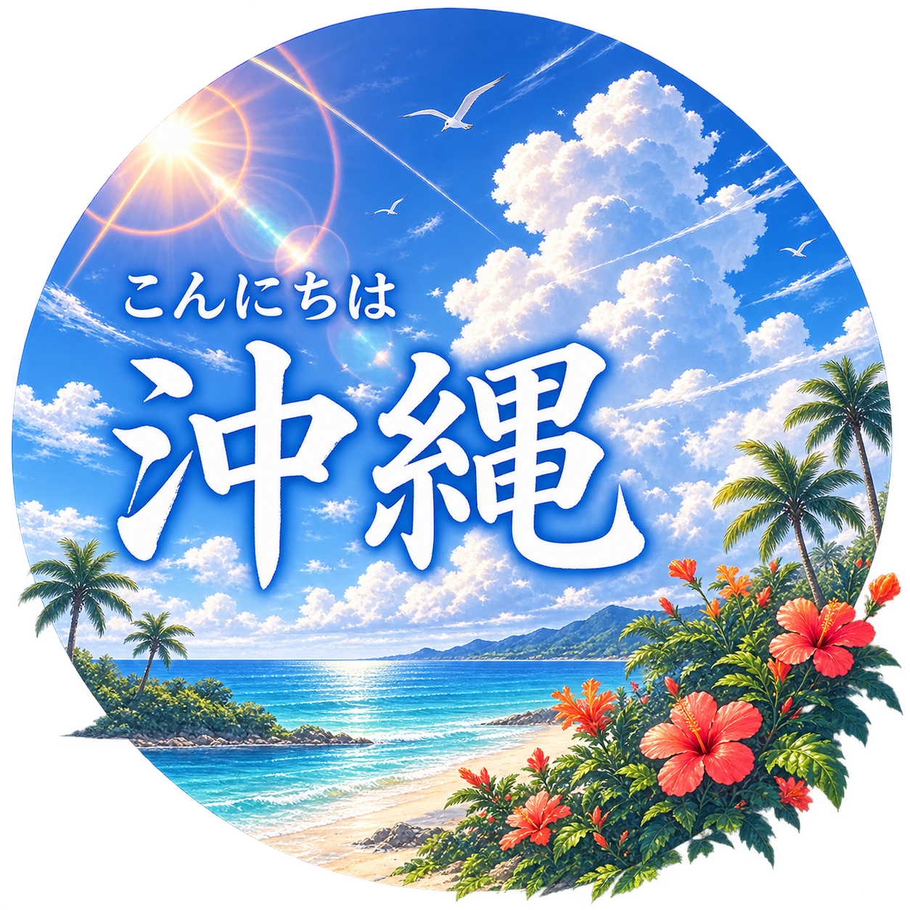

  

# The Ryukyu Realm & Kansai Crossover: From Neon Alleyways to Ocean Waves

Welcome! This repository serves as a digital scrapbook documenting our journey from the vibrant pulse of Osaka to the turquoise waters and tropical shores of Okinawa. Whether you're chasing high-energy city nights in Dotonbori, diving into marine adventures off Sunmarina Resort, or soaking in the coastal landscapes of Cape Manzamo and Kouri Island, this travel blog highlights the best of both worlds.

Explore our detailed logs to spark your wanderlust, and tap into our practical itineraries, budget notes, and route maps to plan your own escape.

## Tech Stack

| Category                   | Details                                                                       |
| :------------------------- | :---------------------------------------------------------------------------- |
| **IDE**                    | [Antigravity](https://antigravity.google/)                                    |
| **Core Stack**             | [Next.js](https://nextjs.org/), [TypeScript](https://www.typescriptlang.org/) |
| **AI - Code Generation**   | [Antigravity](https://antigravity.google/)                                    |
| **AI - Prompt Generation** | [Gemini](https://gemini.google.com/app)                                       |
| **AI - Image Generation**  | [ChatGPT](https://chatgpt.com/)                                               |
